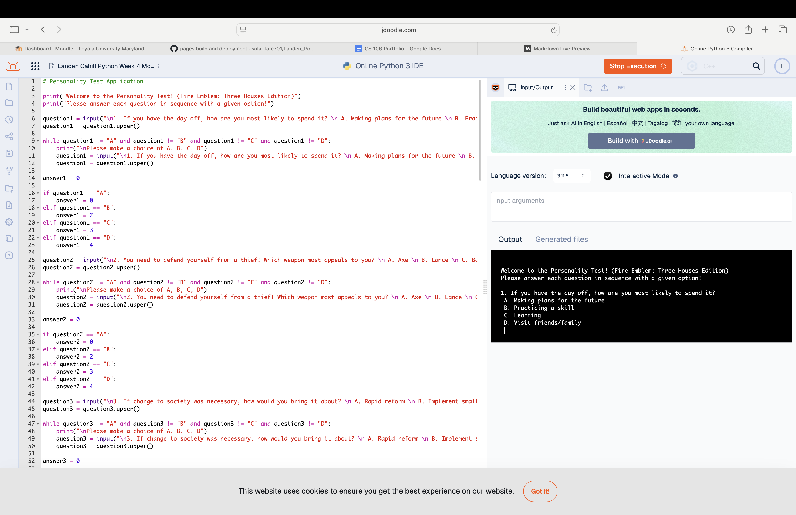
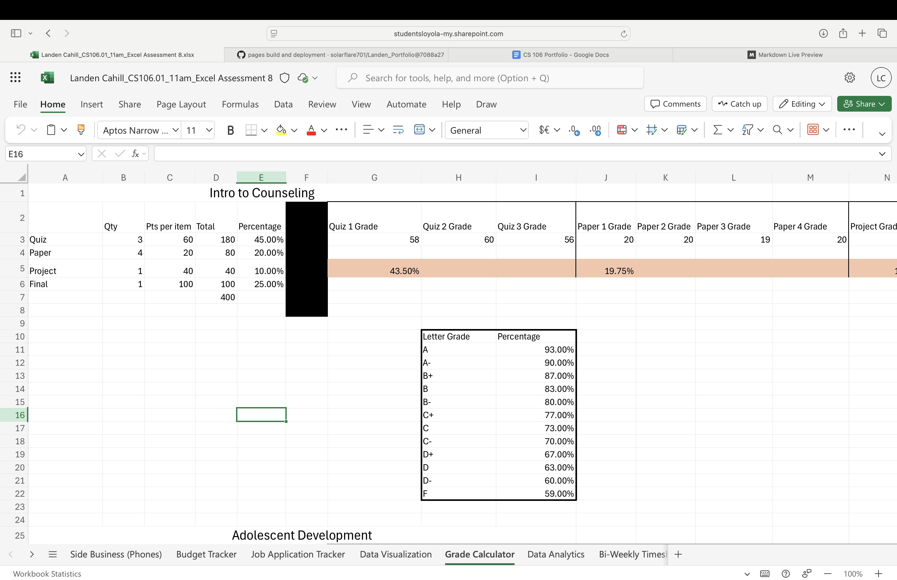
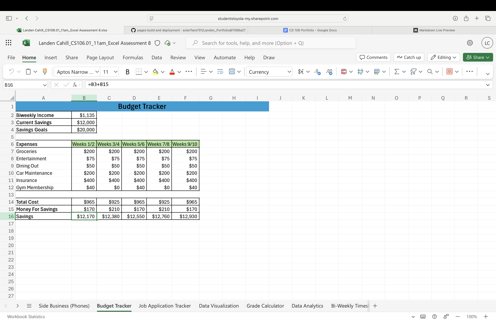

 

# Psychotherapist

### About Me 

Hello! I am a current student and para-professional with over 2 years of proven expertise in psychology and clinical counseling.

With skills in critical thinking, data management using Excel, assessing psychological disorders, writing, and programming in Python, I am able to identify a wide variety of disorders within the DSM-5, and achieve a more satisfied state of living amongst clients. I am adept at using Excel, Python, ScreenPal, and SPSS. 

My robust skill set, commitment to integrity, and passion for counseling make me a valuable asset. In my spare time, I like to write fictional stories and play baseball.

You can find me on [Instagram](https://www.instagram.com/landencahill701/) or [Twitter](https://x.com/solarflare701)

### Education 
BS in Psychology
Loyola University, MD

### Projects

#### Personality Test

**Initial Project Idea 1:** 

With the personality test project I set out to better my understanding of others through a theme I am familiar with. It goes without saying that we are all capable of being elaborate beings with complex thoughts and emotions and reaching a common ground to meet those differences alongside what makes us similar can help bridge the gap between us.

**Tools I used:**

I used the Python coding language on JDoodle to accomplish this goal. I also made use of the character biographies of those I used to act as the themes of the different personalities.

**Challenges I faced:**

The biggest challenge I faced with this project was setting up the scoring portion of the personality test. After some initial test runs, I found it to be almost impossible to naturally score into a couple of the personality types. After reassessing the point values for the answers on the test, I was able to reorient them to make each personality plausible to achieve.

**Other Resources:**

There were no other resources that I used in this endeavor and I did not collaborate with anyone in the production of this project.

**Result:**

I had set out to create a personality test that can sort people’s personalities by applying a character to them that I am familiar with and I was successful in this goal. The primary improvement I would make to this project if I were to take this further would be to add many more questions to the test to ensure that the test results end up being even more accurate.

***
#### Grade Calculator

**Initial Project Idea 2:**

I wanted to create a grade calculator that I could update as I went through the semester to keep tabs on my performance in my classes. This problem needed to be solved as being aware of my current grades is a great way to stay on top of my assignments and ensure I am able to secure a good grade by the end of the semester.

**Tools I used:**

I used Excel to put my grade calculator together through its equations and condition capabilities.

**Challenges I faced:** 

The primary challenge for this project was constructing the grade display for the classes. The equation for each class was very long and messy and thus susceptible for mistakes in the form of extra or missing parts that would throw the whole thing off. I solved this by taking my time when constructing the equation to increase the odds of not making mistakes and a thorough comb through of the equation was the solution to finding the mistakes that arose.

**Other Resources:** 

I did not use any other resources and I did not collaborate with anyone else.

**Result:**

I set out to create a grade calculator that I can use to keep tabs on my grades throughout the semester and I was successful in doing so for two of my classes. The improvements I would make to the assignment if I took it further would be to include all of my classes in the calculator and not just the two currently selected ones.

***
#### Budget Tracker

**Initial Project Idea 3:**

I wanted to make a budget tracker as understanding the financial detriments of living in the modern world weigh over all of us and it is important to understand the requirements that come with living on one’s own. I needed to solve this problem as this information will be incredibly important when I myself am financially independent. 

**Tools I used:**

I once again used Excel in order to set up the tracker as it can use equations to calculate my month to month living expenses and automatically keep track of my savings as well.

**Challenges I faced:**

The challenge I faced was proposing a living situation to simulate with the budget tracker. As I am not currently financially independent I have no personal information to draw from for its creation, but assessing my current lifestyle allowed me to propose the general idea of a few months of living.

**Other Resources:**

I did not use any other resources and I did not collaborate with anyone for this project.

**Result:**

I set out to create a budget tracker that can organize my monthly living expenses and account for the amount of money I saved up month to month and I was successful. If this project was taken further, I would expand the amount of time it covers to allow myself to see a broader picture of living life for longer than the few months currently in the tracker.

